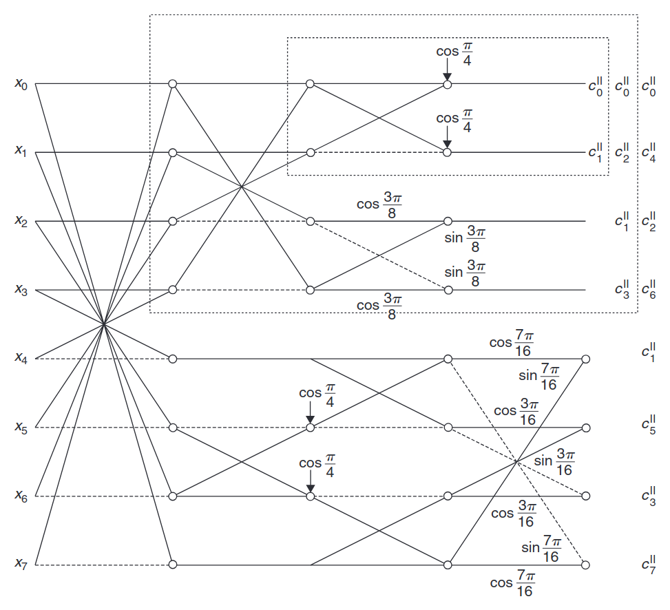

# Discrete Cosine Transform Hardware Accelerator Core

Fourier analysis is a foundational mathematical technique widely employed across signal processing to decompose complex signals from the time/spatial domain into simpler sinusoidal components in the frequency domain. This transformation facilitates signal analysis, filtering, and compression, as it often reveals intrinsic signal characteristics that are otherwise hidden in their original representation.

Real-world signals, such as audio, images, and video, are often band-limited, with less energy concentrated in higher frequencies.
By exploiting this phenomenon, Fourier-based compression methods, most notably the Discrete Cosine Transform (DCT), allow efficient representation of signals. For example, the widely used JPEG image compression standard relies on DCT to retain perceptually important low-frequency content while selectively discarding higher-frequency details that have minimal visual impact [[1]](#ref1). This results in substantial data reduction with minimal perceived quality loss.

This project presents a thoroughly verified hardware implementation of the Fast Integer DCT, grounded in a rigorous mathematical derivation.

## Continuous-Time Fourier Transform (CTFT)

For a continuous-time signal $x(t)$, the Continuous-Time Fourier Transform (CTFT) is defined as:

$$
X(f) = \int_{-\infty}^{\infty} x(t) e^{-j2\pi f t} dt,
$$

provided $x(t)$ is absolutely integrable.


## Discrete-Time Fourier Transform (DTFT)

In many applications, signals are represented with samples at discrete intervals. Sampling a continuous-time signal $x(t)$ at uniform intervals with sampling period $T$, define the discrete-time sampled signal as:

$$
x[n] = T \cdot x(nT), \quad n \in \mathbb{Z}.
$$

The corresponding Discrete-Time Fourier Transform (DTFT) is then a $\frac{1}{T}$ periodic function:

$$
X_{1/T}(f) = \sum_{n \in \mathbb{Z}} x[n] e^{-j2\pi f nT},
$$

with normalized angular frequency $\omega = 2\pi fT$ measured in radians/sample.


## Discrete Fourier Transform (DFT)

As, in practice, signals are of finite length, consider $x[n]$ to be $N$-periodic, with a period composed of sequence $\\{x_n\\}_{n \in [N]}$ , for $[N]$ defined as the index set $\\{0, 1, \dots, N-1\\}$.

Splitting the DTFT sum into groups of length $N$, we have:

$$
X_{1/T}(f) = \sum_{m \in \mathbb{Z}} \sum_{n \in [N]} x[n+mN] e^{-j2\pi f (n+mN)T}.
$$

Using periodicity $x[n+mN] = x[n] = x_n$ for $n \in [N]$, factor the exponent:

$$
X_{1/T}(f) = \left(\sum_{n \in [N]} x_n e^{-j2\pi f nT}\right)\left(\sum_{m \in \mathbb{Z}} e^{-j2\pi f m N T}\right).
$$

The second summation represents a Fourier series expansion of a Dirac comb (periodic impulse function):

$$
\sum_{m \in \mathbb{Z}} e^{-j2\pi f m N T} = \frac{1}{N T} \sum_{k \in \mathbb{Z}} \delta\left(f - \frac{k}{N T}\right).
$$

Thus, the DTFT becomes:

$$
X_{1/T}(f) = \frac{1}{N T} \sum_{k \in \mathbb{Z}} \left(\sum_{n \in [N]} x_n e^{-j2\pi \frac{k}{N} n}\right) \delta\left(f - \frac{k}{N T}\right).
$$

This naturally motivates defining the $N$-point Discrete Fourier Transform (DFT) of $\\{x_n\\}_{n \in [N]}$ as:

$$
X_k = \sum_{n \in [N]} x_n e^{-j2\pi \frac{k}{N} n}, \quad k \in [N].
$$

Hence, observe that the non-zero components of the DTFT of a $N$-periodic discrete-time signal are manifestations of the DFT coefficients of the signal:

$$
X_{1/T}(f) = \frac{1}{NT}\sum_{k\in\mathbb{Z}} X_k \delta\Bigl(f-\frac{k}{NT}\Bigr)
$$


## Discrete Cosine Transform (DCT)

For real-word real-valued signals ($x_n \in \mathbb{R}$), a useful transform is obtained by considering an even symmetric extension of the sequence $\\{x_n\\}_{n\in[N]}$ defined as [[2]](#ref2):

$$
y_n = \begin{cases}
x_n, & 0 \leq n < N \\
x_{2N - 1 - n}, & N \leq n < 2N
\end{cases}
$$

Taking the DFT of $y_n$, we have:

$$
Y_k = \sum_{n \in [2N]} y_n e^{-j2\pi \frac{k}{2N} n} = \sum_{n=0}^{N-1} x_n e^{-j \frac{\pi k}{N} n} + \sum_{n=N}^{2N-1} x_{2N-1-n} e^{-j \frac{\pi k}{N} n}.
$$

Simplify the second summation by substituting $n' = 2N - 1 - n$:

$$
Y_k = \sum_{n \in [N]} x_n \left(e^{-j \frac{\pi k}{N} n} + e^{-j \frac{\pi k}{N}(2N - 1 - n)}\right).
$$

Simplifying the exponential:

$$
e^{-j \frac{\pi k}{N} n} + e^{-j \frac{\pi k}{N}(2N - 1 - n)} = e^{-j \frac{\pi k}{N} n} + e^{j \frac{\pi k}{N}(n+1)}.
$$

Furthermore, factoring out the common exponent:

$$
e^{j \frac{\pi k}{2N}} \left[e^{-j \frac{\pi k}{N}(n+\frac{1}{2})} + e^{j \frac{\pi k}{N}(n+\frac{1}{2})}\right] = 2 e^{j \frac{\pi k}{2N}} \cos\left(\frac{\pi k}{N}\left(n + \frac{1}{2}\right)\right),
$$

results in the DFT of the symmetrically extended sequence:

$$
Y_k = 2 e^{j \frac{\pi k}{2N}} \sum_{n \in [N]} x_n \cos\left(\frac{\pi k}{N}\left(n + \frac{1}{2}\right)\right).
$$

Discarding the phasor, and introducing a normalization factor $\alpha(k)$, the Type-II Discrete Cosine Transform (DCT-II) is defined as:

$$
C_k = \alpha(k) \sum_{n \in [N]} x_n \cos\left[\frac{\pi}{N}\left(n + \frac{1}{2}\right)k\right], \quad k \in [N],
$$

where

$$
\alpha(k) = \begin{cases}
\frac{1}{\sqrt{2}}, & k = 0 \\
1, & k \neq 0
\end{cases}
$$

ensures orthogonality of the DCT basis. Additionally, scaling by $\sqrt{2/N}$ normalizes the basis functions.

Within the lexicon of this report, DCT refers to DCT-II—the premier trigonometric transform in signal representation and data compression due to its strong energy compaction properties [[3]](#ref3).

## Fast Discrete Cosine Transform

The computation of the DCT can be optimized by identifying and reusing common intermediate values. By factorizing the DCT into stages, as demonstrated by the Arai-Agui-Nakajima (AAN) algorithm [[4]](#ref4), intermediate results can be shared across calculations, eliminating redundant operations. This optimization yields a computation complexity to $O(N \log N)$ compared to the naive summation of $O(N^2)$, regarded as a fast algorithm [[5]](#ref5).

|                                                                                        |
| :---------------------------------------------------------------------------------------------------------------------------------: |
| Image 1. *The generalized signal flow graph for the DCT-II computation for N = 2, 4 and 8 based on the AAN algorithm [[6]](#ref6).* |

Figure 1 visualizes the butterfly structure of the AAN algorithm for the 8-point DCT. Each node represents a weighted summation of its two preceding nodes (forming the butterfly structure), with weights (scaling factors) annotated on connecting edges. Dashed edges indicate that the corresponding input is negated. When two incoming edges share identical scaling factors, these factors are absorbed into the node itself.

The diagram illustrates the recursive radix-2 nature of the even branch, wherein it is successively decomposed into a 4-point DCT, which is further split into a 2-point DCT.

A manual computation of the DCT as defined by the signal flow graph, confirms its equivalence to the aforementioned mathematical expression.

## Integer Discrete Cosine Transform (IntDCT)

In practical applications, an integer-based approximation of the DCT, called the Integer Discrete Cosine Transform (IntDCT), is commonly employed [[7]](#ref7). The IntDCT uses efficient fixed-point integer arithmetic applied to integer-valued input sequences $x_n \in \mathbb{Z}$ and quantized integer coefficients, yielding a finite precision estimation of the DCT coefficients:


$$
C_k^{\text{Int}} = \frac{Q\bigl(\alpha(k)\bigr) \sum_{n=[N]} x_n Q\left(\cos\left[\frac{\pi}{N}\Bigl(n+\frac{1}{2}\Bigr)k\right]\right).}{S}
$$

with scaling factor $S$, where $Q(.)$ is the quantization operator, mapping a real number to the nearest integer in the fixed-point representation:

$$
Q(x) = \lfloor x \cdot S + 0.5 \rfloor
$$

Note that the division by $S$ can be expanded and carried out as integer division or considered an implied rational division, depending on the computational stage and the desired numerical precision.

For a reference implementation, the computation is iteratively performed with floating-point arithmetic, with quantization applied at the final stage:

$$
C_k^{\text{Int}} \simeq \frac{Q\Bigl(C_k\Bigr)}{S} = \frac{Q\Biggl(\alpha(k) \sum_{n \in [N]} x_n \cos\left[\frac{\pi}{N}\Bigl(n+\frac{1}{2}\Bigr)k\right]\Biggr)}{S}.
$$

Note that both quantization approaches are asymptotically equivalent for sufficiently large scaling factors $S$.

### Hardware Implementation

This hardware core implements a Fast IntDCT algorithm with parameters $N = 8$ and $S = 2^{15}$. It processes 8-bit integer inputs $x_n$, corresponding to the channel size commonly used in JPEG image compression [[1]](#ref1), and produces 20-bit Q6 fixed-point outputs $C_k^{\text{Int}}$. This implementation has been numerically verified to be accurate within one bit ($\frac{1}{64}$) of the floating-point reference computation.

The transform is encapsulated within a SystemVerilog module ([`rtl/int_dct8.sv`](../rtl/int_dct8.sv)), implementing a pipelined butterfly structure as specified by the AAN algorithm (see Figure 1). This structure comprises a 4-stage pipeline, wherein each stage performs a single addition and two multiplication operations using integer arithmetic to ensure timing closure and consistent propagation delays. Additionally, a validation handshake signal is propagated through each stage to maintain pipeline synchronization and correctness of outputs.

Given 8-bit integer inputs and 16-bit Q15 scaling factors, intermediate computational stages maintain the Q15 fixed-point format with the minimum number of bits that avoid overflow. The the 9 least significant fractional bits are discarded, due to their inconsistency with the reference model, yielding a 20-bit Q6 fixed-point output. 

The Q15 quantized representation of scaling factor constants is computed using the script [`aux/gen_q15_trig.py`](../aux/gen_q15_trig.py).

### Verification

The verification environment ([`tb/`](../tb/)) employs a modular and reuseable custom UVM framework implemented with Verilator, leveraging modern C++20 practices for clarity, maintainability, and performance.

- `agent`: provides an interface to the Design Under Test (DUT) by driving and montoring the input/output signals, including the clock.
- `reference`: implements a naive, iterative ground-truth calculation of the DCT (see [IntDCT](#integer-discrete-cosine-transform-intdct)) using floating-point arithmetic and quantization for verification purposes.
- `test`: encapsulates the testbench logic, by executing both custom test cases –including stress and edge conditions– and randomized test cases, while tracking and reporting discrepancies between the DUT and reference model via a scoreboard.

Using this environment, the hardware core has been verified to be accurate within a $\frac{1}{64} = 0.015625$ deviation of the reference model, attributable to different quantization processes in the integer vs floating-point computation (see [IntDCT](#integer-discrete-cosine-transform-intdct)).

### Integration and Expected Performance

Integration of the 8-point DCT core into larger systems is straightforward. For typical video-processing applications involving two-dimensional DCTs (2D DCT), such as JPEG compression, the core can serve as a fundamental building block. By partitioning data into 8×8 blocks and sequentially applying the DCT first on rows and then columns–using either two separate cores or reusing a single core with a transpose memory in between—this hardware facilitates efficient computation of generic-sized 2D DCTs.

By employing the Fast IntDCT hardware architecture described above, we anticipate excellent performance suitable for real-time data processing, even with a single DCT core. The throughput is particularly notable: a fully pipelined 8-point DCT module produces one complete 8-point result per clock cycle. At a moderate operating frequency of 100 MHz, this yields to 100 million DCT operations per second, sufficient for processing over 48 full Ultra High Definition (4K) video frames per second—each 4K frame consisting of 2,073,600 one-dimensional 8-point DCT computations. With higher clock frequencies on advanced FPGA platforms; post-synthesis analysis of a similar pipelined DCT architecture suggests operation frequencies approaching 2 GHz, yielding approximately 2 billion 8-point DCT computations per second, verifying our expected performance [[8]](#ref8).

Moreover, the latency for a single 8-point DCT computation is just 4 clock cycles. For instance, at 100 MHz, the delay to process a full frame is less than half the frame interval for standard HD (1080p) video at 30 frames per second. Notably, this latency is deterministic and consistent, simplifying integration into real-time processing pipelines.

We also anticipate significant power and area efficiency gains. By significantly reducing the number of multiplications and primarily utilizing simpler addition and shift operations, the design minimizes power consumption, while requiring less area for the minimal arithmetic.

## Build and Run

From the project's root directory, execute:
```bash
cmake -B build
cd build
make
```

### Running the Testbench
In the build directory, run the testbench by executing:
```bash
make run_sim
```

The testbench executes both custom and randomized test cases, outputs a summary scoreboard, and provides detailed information on any failed test cases.

## References

<a id="ref1"></a>
[1] G. K. Wallace, "The JPEG still picture compression standard," *IEEE Transactions on Consumer Electronics*, vol. 38, no. 1, pp. xviii–xxxiv, Feb. 1992. [Online]. Available: https://ieeexplore.ieee.org/document/125072. doi: [10.1109/30.125072](https://doi.org/10.1109/30.125072).

<a id="ref2"></a>
[2] J. Makhoul, "A fast cosine transform in one and two dimensions," *IEEE Transactions on Acoustics, Speech, and Signal Processing*, vol. 28, no. 1, pp. 27–34, Feb. 1980. [Online]. Available: https://ieeexplore.ieee.org/document/1163351. doi: [10.1109/TASSP.1980.1163351](https://doi.org/10.1109/TASSP.1980.1163351).

<a id="ref3"></a>
[3] V. Britanak, P. C. Yip, and K. R. Rao, *Discrete Cosine and Sine Transforms: General Properties, Fast Algorithms and Integer Approximations*. Academic Press, 2006, p. 66.

<a id="ref4"></a>
[4] Y. Arai, T. Agui, and M. Nakajima, "A fast DCT-SQ scheme for images," *The Transactions of the IEICE*, vol. E71, no. 11, pp. 1095–1097, Nov. 1989.

<a id="ref5"></a>
[5] M. Püschel and J. M. F. Moura, "The algebraic approach to the discrete cosine and sine transforms and their fast algorithms," *SIAM Journal on Computing*, vol. 32, no. 5, pp. 1280–1316, 2003. [Online]. Available: https://epubs.siam.org/doi/abs/10.1137/S009753970139272X. doi: [10.1137/S009753970139272X](https://doi.org/10.1137/S009753970139272X).

<a id="ref6"></a>
[6] V. Britanak, P. C. Yip, and K. R. Rao, *Discrete Cosine and Sine Transforms: General Properties, Fast Algorithms and Integer Approximations*. Academic Press, 2006, p. 98.

<a id="ref7"></a>
[7] J. Chen, S. Liu, G. Deng, and S. Rahardja, "Hardware efficient integer discrete cosine transform for efficient image/video compression," *IEEE Access*, vol. 7, pp. 152635–152645, 2019. [Online]. Available: https://ieeexplore.ieee.org/document/8868087. doi: [10.1109/ACCESS.2019.2947269](https://doi.org/10.1109/ACCESS.2019.2947269).

<a id="ref8"></a>
[8] A. Edirisuriya, A. Madanayake, V. S. Dimitrov, R. J. Cintra, and J. Adikari, "VLSI architecture for 8-point AI-based Arai DCT having low area-time complexity and power at improved accuracy," *Journal of Low Power Electronics and Applications*, vol. 2, no. 2, pp. 127–142, 2012. [Online]. Available: https://www.mdpi.com/2079-9268/2/2/127. doi: [10.3390/jlpea2020127](https://doi.org/10.3390/jlpea2020127).
